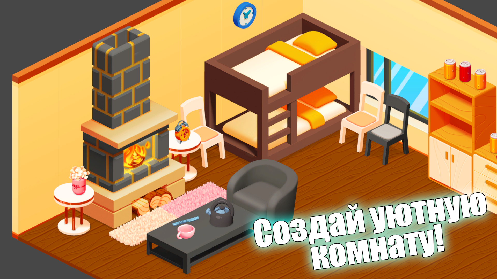
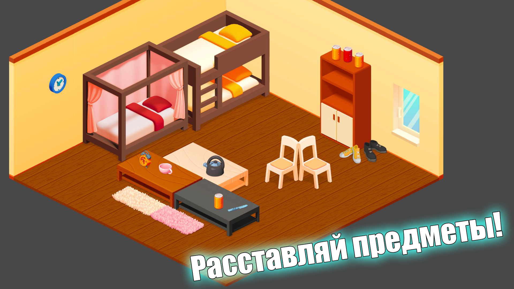
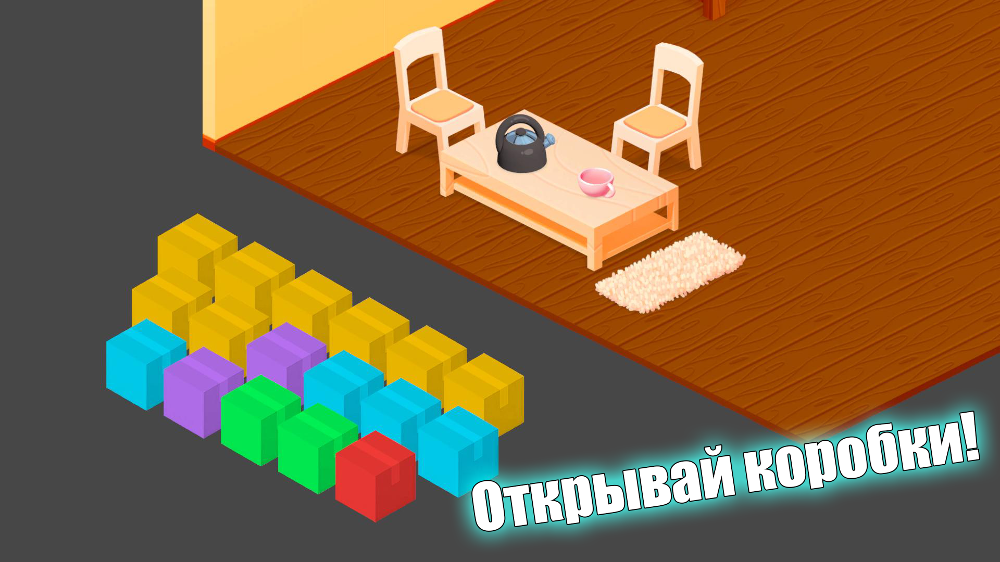

  

<h1 align="center">Art House</h1>

  Казуальная игра про обустройство комнаты: открывай коробки, собирай мебель и собирай интерьер в изометрии.

  
  
  

---

## Геймплей

Игрок обставляет одну комнату предметами интерьера: кровати, кресла, столы, ковры, часы, посуда и мелочи. Комната показана в изометрии, предметы ставятся на пол и на стены, их можно поворачивать и ставить друг на друга.

  
  

Предметы приходят карточками из цветных коробок. У карточки есть тип предмета и редкость — от обычной до легендарной. Одинаковые предметы сливаются в более редкий вариант, лишнее можно продать.

Комната растёт вместе с игроком:

- **Задания** дают прогресс и награды, в том числе новые коробки.
- **Доход** копится, пока предметы стоят в комнате, и продолжает капать в офлайне.
- **Уровень комнаты** открывает новые визуальные стили стен и пола.
- **Расширение** увеличивает площадь, на которой можно расставлять мебель.
- **Автомат с призами** — отдельная мини-игра за билеты.

## Техническая часть

Проект на **Unity 2022.3 LTS** и **Universal Render Pipeline**. Геймплейная сцена собирается через **Zenject**: контроллеры комнаты, магазина, дохода, заданий, престижа и туториала живут как синглтоны сцены.

Состояние хранится в реактивном `GameState` на **R3**: деньги, карточки, иерархия расставленных предметов, уровень расширения и стиль комнаты. Конфиги (доход, задания, размеры комнаты, вероятности коробок) вынесены в данные и читаются через `ConfigHub`.

Расстановка построена на своей изометрической сетке с тремя плоскостями — пол, левая и правая стены. Мировые координаты считаются по трём осям проекции. Глубина спрайтов не зашита вручную: пересекающиеся предметы упорядочиваются топологической сортировкой, и `sorting order` выставляется по результату.

Ввод разделён на мобильный и десктопный. Анимации интерфейса и предметов — **DOTween** и **UniTask**.
